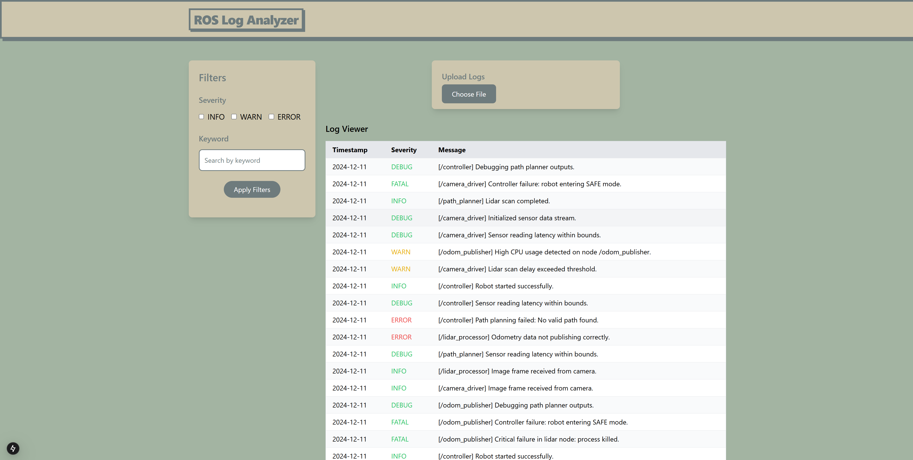

# ROS Log Viewer Web Application - Detailed Project Specification

## Project Overview
Develop a web-based ROS (Robot Operating System) Log Viewer and Analyzer application that allows users to upload, parse, and analyze robot system logs with advanced filtering and search capabilities.

## Core Objectives
- Create a user-friendly interface for log file analysis
- Implement robust log parsing and visualization
- Provide intuitive filtering and search mechanisms

## Technical Requirements

### Frontend
- Framework: Next.js
- Styling: Tailwind CSS
- State Management: React Hooks
- Responsive Design: Mobile and desktop compatible

### Log Parsing Features
1. File Upload Functionality
- Support .log and .txt file formats
- Validate file type before processing
- Handle large log files efficiently
- Display upload errors gracefully

2. Log Data Extraction
Parse log entries with the following mandatory fields:
- Unique Identifier
- Timestamp
- Severity Level (INFO, WARN, ERROR, DEBUG)
- Node Name
- Full Message Content

## Key User Interface Components

### Log Uploader
- Drag and drop file upload
- File type validation
- Error handling for invalid files
- Clear visual feedback during upload

### Log Viewer Table
- Paginated log display
- Sortable columns
- Color-coded severity levels
- Responsive table design

### Filtering Capabilities
1. Severity Level Filter
- Dropdown to select specific severity levels
- Option to show/hide log types
- Multi-select severity filtering

2. Search Functionality
- Real-time search across log messages
- Keyword highlighting
- Case-insensitive search

3. Advanced Filtering
- Date range selection
- Node name filtering
- Custom filter combinations

## Bonus Features
- Export filtered logs to CSV/JSON
- Advanced log statistics
- Log message detail modal
- Performance optimization for large log files

## Technical Constraints
- Use TypeScript for type safety
- Implement clean, modular code structure
- Optimize performance for log processing
- Implement proper error boundaries

## Performance Considerations
- Lazy loading of log entries
- Efficient filtering mechanisms
- Minimize re-renders
- Handle large log files (100,000+ entries)

## Security Requirements
- Sanitize file uploads
- Prevent XSS in log message display
- Limit file upload size
- Validate file content

## Deployment Preparation
- Docker containerization
- Environment configuration
- CI/CD pipeline considerations

## Deliverables
1. Complete source code repository
2. Comprehensive README.md
3. Setup and installation instructions
4. Example log files for testing

## Evaluation Criteria
- Code quality and readability
- User interface design
- Performance efficiency
- Error handling
- Extensibility of the solution

## Technology Stack
- Frontend: Next.js 13+
- Language: TypeScript
- Styling: Tailwind CSS
- State Management: React Hooks
- Parsing Library: Custom implementation or Papa Parse
- Deployment: Vercel/Netlify recommended

## Application Image
